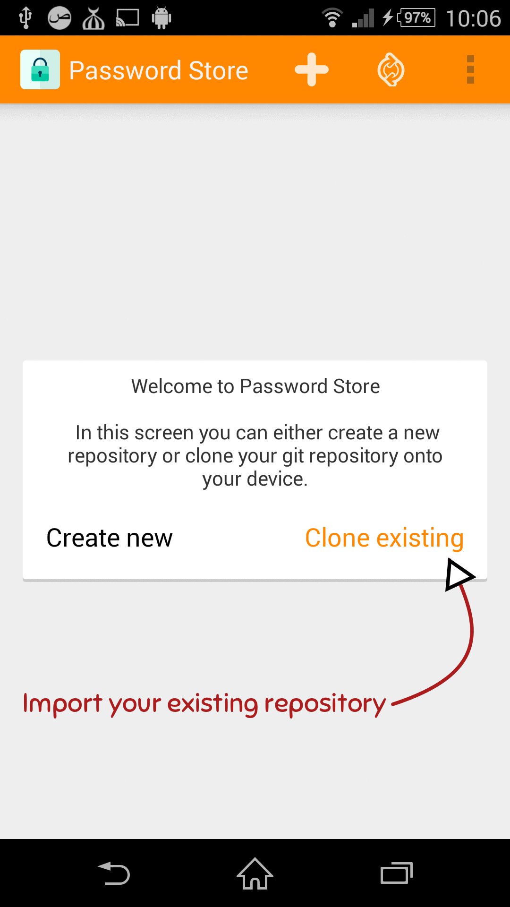

PwdStore
========
[](https://webchat.freenode.net/?channels=%23Android-Password-Store&uio=d4)
[](https://gitter.im/zeapo/android-password-store?utm_source=badge&utm_medium=badge&utm_campaign=pr-badge&utm_content=badge)
[](https://android-arsenal.com/details/1/1208)
[](https://travis-ci.org/zeapo/Android-Password-Store)

**Donations**: 
[](https://flattr.com/submit/auto?user_id=zeapo&url=https://github.com/zeapo/Android-Password-Store&title=Android-Password-Store&language=en&tags=github&category=software) or bitcoin `1HnBdmZGnYnfbNVG4iiUWN4KmoGdw6fi8i`

This application tries to be 100% compatible with [pass](http://www.passwordstore.org/)

You can install the application from:

- [F-Droid](https://f-droid.org/repository/browse/?fdid=com.zeapo.pwdstore) (the prefered way)
- [Play Store](https://play.google.com/store/apps/details?id=com.zeapo.pwdstore) (always lags behind)

Pull requests are more than welcome (see [TODO](#todo)).

How-To
======
See the wiki https://github.com/zeapo/Android-Password-Store/wiki/First-time-setup for a newer written version of the following gif walkthrough

FAQ
====

- **Q:** What kind of repository can I clone from?
- **A:** Make sure to only clone from bare repositories (see [git-clone(1)](http://git-scm.com/docs/git-clone) for how to create a bare repository from an existing one). Otherwise the clone will fail.
- **Q:** I get a "Permission Denied" error when trying to import my ssh-key, why?
- **A:** ssh-key files are usually created with permissions set to `600`, meaning that only the creator of this key has the right to read from it. The application needs a read access, at least temporarily, make the permissions to `644`, import the key, then set them back to `600`.
- **Q:** I tried to use APG and it does not work... why?
- **A:** We only support OpenKeychain.
- **Q** I get the error *No encrypted data with known secret key found in stream*
- **A** In OpenKeyChain **(under the left drawer) Apps > Password Store > Accounts > (select the account) > Account key** select the key used to encrypt your passwords.

Community
=========

A few ways to get in touch:

- [Github issues](https://github.com/zeapo/Android-Password-Store/issues), use it if you have a bug report, you do not understand how somehting works or feature request
- [reddit](https://www.reddit.com/r/androidpwd), want to discuss something and it's midnight, no one on irc and you really want to write more than a couple of lines? reddit is your way!


TODO
=====
- ~~Implement a keyboard to replace the copy/paste and avoid clipboard hijicking (see [#50](https://github.com/zeapo/Android-Password-Store/issues/50))~~ (Autofill does the job)
- Create a new category
- Multiple password stores (multiple git repositories).
- Solve issues labeld as *enhancement* (see [enhancement issues](https://github.com/zeapo/Android-Password-Store/issues?q=is%3Aopen+is%3Aissue+label%3Aenhancement))


Generate a ssh key for your git repo
--------------------------------------------
###From the application###
- Go to **settings** > **Generate SSH key pair**
- Select the key size (length)
- Set the passphrase (optional) and a comment (optional)
- Press **Generate**
- Press **Copy** to copy the public key and add it to your ssh server

###From a terminal###
- Generate the private and public key
```
ssh-keygen -C droid_phone -b 2048 -t rsa -f /tmp/id_rsa_droid
```
- Copy the public key `/tmp/id_rsa_droid.pub` on your ssh server and add in to the `~/.ssh/authorized_keys` file
```
cat id_rsa_droid.pub >> ~/.ssh/authorized_keys
```
- Copy the private key `/tmp/id_rsa_droid`to your phone and import it in your Android-Password_Store app through the settings

Export your gpg private key
--------------------------------------------
- Get your pass script gpg id(s) ie: `cat ~/.password-store/.gpg-id`
- You can also get a full ids list using `gpg -k`
- Export your private key with 
```
gpg --export-secret-key [the_id] > keys.asc
```
- Import it in OpenKeychain

Clone using SSH-key, then decrypt a password
--------------------------------------------




Features
========
- Clone an existing pass repository (ssh-key and user/pass support)
- List the passwords
- Handle the directories as categories
- Decrypt the password files (first line is the password, the rest is extra data)
- Add a new password to the current category (or no category if added at the root)
- Pull and Push changes to the remote repository
- Ability to change remote repository info

Libraries
=========
This project uses three libraries:

- [OpenKeyChain](https://github.com/open-keychain/open-keychain) for encryption and decryption of passwords.
    To download the library, run the following commands at the root of the project

        git submodule init
        git submodule update


- [JGit](http://www.eclipse.org/jgit/) a pretty good git lib
- [Apache's FileUtils](https://commons.apache.org/proper/commons-io/) for files manipulations


[](https://www.changetip.com/tipme/zeapo)
